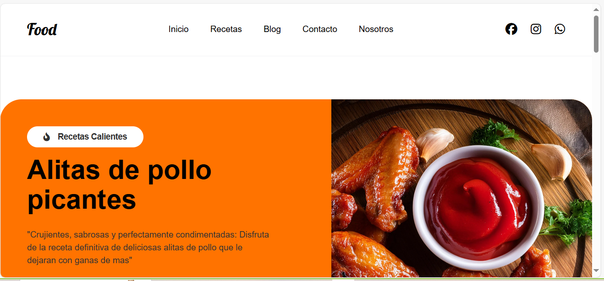
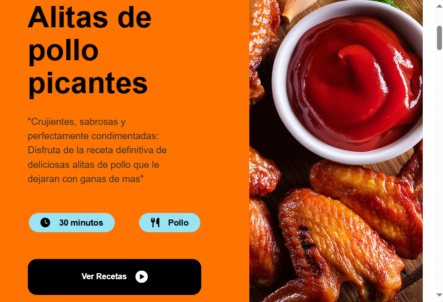
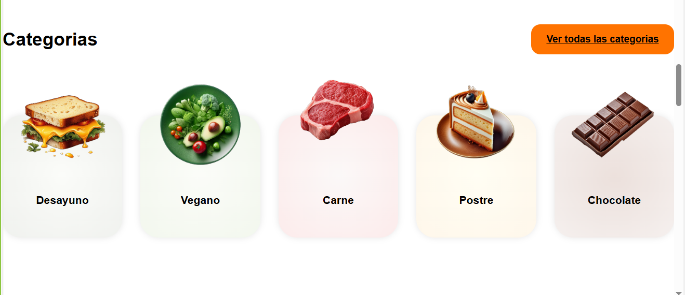
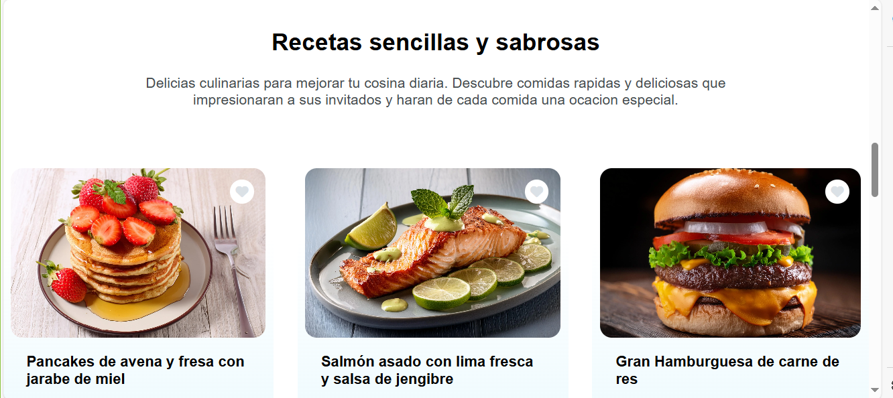
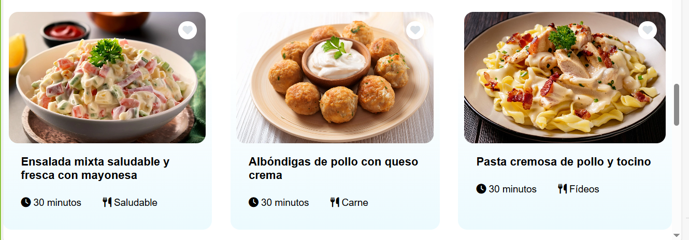
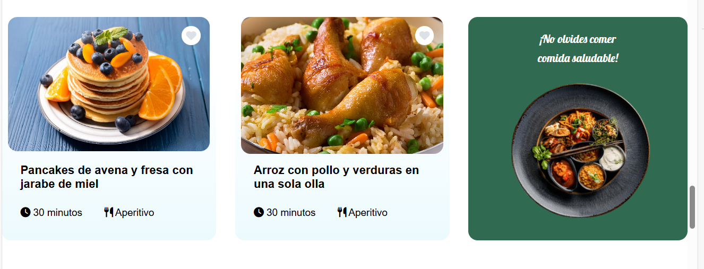
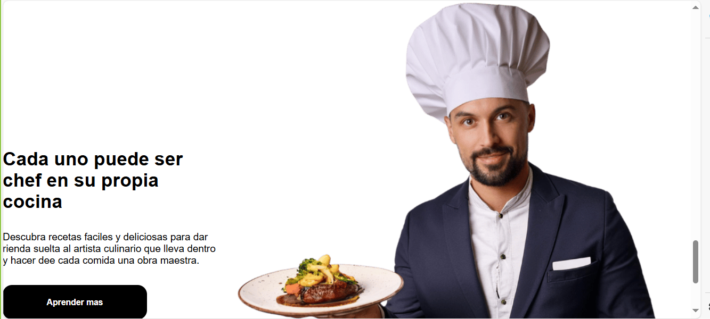

# Sitio Web de Recetas de Comidas

¡Bienvenidos a la Pagina Web de Recetas de Comidas! En este sitio web, los usuarios podran explorar una gran variedad de recetas deliciosas.




## Tabla de Contenidos

- [Descripción del Proyecto](#descripción-del-proyecto)
- [Características](#características)
- [Tecnologías Utilizadas](#tecnologías-utilizadas)
- [Estructura del Proyecto](#estructura-del-proyecto)
- [Instalación](#instalación)
- [Uso](#uso)
- [Estado del Proyecto](#estado-del-proyecto)
- [Contribuciones](#contribuciones)
- [Licencia](#licencia)

## Descripción del Proyecto

Esta Pagina web está desarrollada para compartir recetas culinarias, proporcionando a los usuarios una interfaz amigable y atractiva, para descubrir y disfrutar de diversas categorías de recetas. Con un diseño responsivo, el sitio es accesible desde cualquier dispositivo.

## Características

- **Interfaz Responsiva**: Se adapta a diferentes tamaños de pantalla.
- **Navegación Intuitiva**: Acceso fácil a categorías y recetas.
- **Categorías de Recetas**: Incluye Desayuno, Vegano, Carne, Postre y Chocolate.
- **Sección Destacada**: Muestra recetas populares.
- **Menú Móvil**: Acceso fácil en dispositivos móviles.
- **Estilos Modernos**: Utiliza CSS para un diseño atractivo.

## Imagenes relacionadas a estas caracteristicas









## Tecnologías Utilizadas

- **HTML5**: Estructura del contenido.
- **CSS3**: Estilos y diseño responsivo.
- **JavaScript**: Interactividad y funcionalidad del menú.
- **Font Awesome**: Iconos para mejorar la experiencia del usuario.

## Instalación

1. Clona el repositorio en tu máquina local:

```bash
git clone https://github.com/luismanuelcldev/Sitio-web-Recetas-de-Comidas.git
```

2. Navega a la carpeta del proyecto:

```bash
cd Sitio-web-Recetas-de-Comidas
```

3. Abre el archivo index.html en tu navegador web para ver el sitio.


## Uso

- Navega por las diferentes categorías de recetas usando el menú.

- Visualiza recetas destacadas en la sección principal.

- Utiliza el menú móvil para acceder a las opciones en dispositivos más pequeños.

## Estado del Proyecto

- Versión Actual: 1.0

- Estado: En desarrollo / Mantenimiento.

- Próximas Características: Añadir más recetas, mejorar la interactividad del sitio.

## Contribuciones
